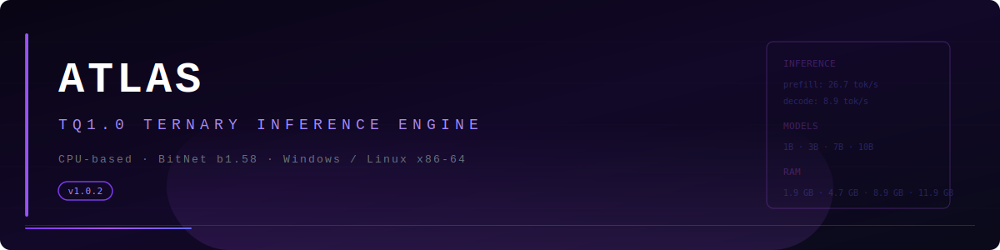

<p align="center">
  
</p>

# ATLAS — TQ1.0 Ternary Inference Engine

ATLAS is a CPU-based inference engine for BitNet b1.58 ternary-quantized language models. It repacks HuggingFace safetensors into the **TQ1.0** format (5 ternary trits packed per byte, Base-3 encoded) and runs fast inference through a hybrid C++ library + Python pipeline. No GPU required. Runs on an i5 laptop with 16 GB RAM. **Windows + Linux x86-64.**

## Motivation

BitNet b1.58 models replace full-precision weights with ternary values (-1, 0, +1), reducing memory by 16-32x versus FP16. However, existing inference frameworks target CUDA GPUs, leaving CPU users unable to run these models. ATLAS fills this gap: it packs ternary weights into a compact TQ1 format and uses int8 AVX2 matmuls on CPU to achieve usable decode speeds on commodity hardware.

## Supported Models

| Model | File | Atlas Size | Layers | Hidden | Intermediate | Heads | KV Heads |
|-------|------|-----------|--------|--------|-------------|-------|----------|
| Falcon3-1B-Instruct-1.58bit | `falcon3-1b-tq1_0.atlas` | 1.21 GB | 18 | 2048 | 8192 | 8 | 4 |
| Falcon3-3B-Instruct-1.58bit | `falcon3-3b-tq1_0.atlas` | 1.95 GB | 22 | 3072 | 9216 | 12 | 4 |
| Falcon3-7B-Instruct-1.58bit | `falcon3-7b-tq1_0.atlas` | 2.74 GB | 28 | 3072 | 23040 | 12 | 4 |
| Falcon3-10B-Instruct-1.58bit | `falcon3-10b-tq1_0.atlas` | 3.27 GB | 40 | 3072 | 23040 | 12 | 4 |

All use `head_dim=256`, `rope_theta=1000042`, `vocab_size=131072`, GQA architecture. The .atlas extension identifies the file as loadable by the ATLAS engine; the tq1_0 suffix indicates TQ1.0 format version 0 (Base-3, 5 trits/byte).

1B and 3B models fit comfortably in **8 GB RAM** (see Memory table). The 3B offers the best quality-to-speed ratio for memory-constrained systems.

## Quick Start

### Requirements

- Python 3.10+ with `numpy`, `safetensors`, `transformers`
- 16 GB RAM (no GPU). **1B and 3B models fit in 8 GB RAM.**
- Windows x86-64 (Clang LLVM-MinGW) **or** Linux x86-64 (GCC/Clang)
- To rebuild: Clang (Windows) or GCC/Clang (Linux) with OpenMP, AVX2+FMA support

```
pip install numpy safetensors transformers
```

`torch` is only needed if you want to repack from safetensors (the packer can use it for faster tensor ops, but `numpy` fallback works). Inference requires no PyTorch at all.

### 1. Pack safetensors into ATLAS format

```bash
python atlas_packer.py path/to/model.safetensors falcon3-10b-tq1_0.atlas
```

The packer reads the safetensors file, de-interleaves BitNet's 4-row-packed uint8 format, repacks each weight row into TQ1 Base-3 bytes, and writes an ATLAS file with a 64-byte header, 12-byte-per-tensor directory, and tensor data blobs. The model directory (containing `config.json` and tokenizer) is inferred from the safetensors path.

Pre-built atlas files are named `falcon3-{size}b-tq1_0.atlas` following the convention `{model}-{size}b-tq1_0.atlas`.

### 2. Run inference

```bash
python atlas_infer.py falcon3-10b-tq1_0.atlas path/to/model_dir "What is the capital of France?"
```

The inference script loads the atlas file into the C++ DLL, initializes the tokenizer from the model directory, and runs autoregressive generation with GQA attention, RoPE, KV cache, SiLU FFN, and temperature sampling.

### 3. Compile the C++ library (if modifying code)

**Windows:**
```bash
compile.bat
```

Requires `clang++` (LLVM MinGW) in PATH. Builds `atlas.dll` with AVX2+FMA+OpenMP and F16C.

**Linux:**
```bash
chmod +x compile-linux.sh && ./compile-linux.sh
```

Builds `libatlas.so` with GCC or Clang (`-fopenmp -mavx2 -mfma -fPIC`).

**Linux dependencies:** If using GCC (`g++`), OpenMP is built-in via `libgomp`. If using Clang (`clang++`), install `libomp-dev`:
```bash
# Ubuntu/Debian
sudo apt install libomp-dev
# Fedora
sudo dnf install libomp-devel
```

OpenMP is enabled by default. On Windows, `libomp.dll` must be discoverable at runtime — copy it from `llvm-mingw\x86_64-w64-mingw32\bin\libomp.dll` next to `atlas.dll`, or add that directory to `PATH`.

**Windows-specific**: The MKL backend that numpy may use loads `libiomp5md.dll`, a different OpenMP runtime. This causes `OMP: Error #15` at import time. `atlas_infer.py` sets `KMP_DUPLICATE_LIB_OK=TRUE` automatically to suppress this. If you see the error despite this, set `KMP_DUPLICATE_LIB_OK=TRUE` in your environment before running.

## Architecture

```
safetensors ──► atlas_packer.py ──► .atlas file ──► atlas_infer.py ──► atlas.dll / libatlas.so
                                                         │
                                                    atlas_forward (fused N layers, C++)
                                                         │
                                              ┌──────────┼──────────┐
                                          RMSNorm  Attention  FFN(SiLU)   ◄─ all in C++, per layer
                                         (C++)      (C++)     (7× int8)
                                                         │
                                              Final RMSNorm + LM head (Python, numpy)
```

### Pipeline stages

1. **Packer** (`atlas_packer.py`): Reads HuggingFace safetensors with pre-quantized 2-bit packed weights (`byte = v0 + v1*4 + v2*16 + v3*64`). De-interleaves the BitNet row-aware format (4 weight rows per uint8 row). Repacks each row independently into TQ1.0: 5 ternary trits mapped to Base-3 values 0-242, padded with ternary-0 (mapped from value 1) to fill the last byte. FP16 per-tensor scales are stored as 2-byte prefixes.

2. **ATLAS file format**: Binary file with a 64-byte header (magic "ATLAS", layer count, hidden dim, intermediate dim, head counts, vocab size, tensor count). Followed by a directory of 12-byte entries (ttype, file offset, row dim, packed cols). Tensor data follows: TQ1 weights (ttype=0) have a 2-byte FP16 scale prefix followed by packed rows; embeddings/norms (ttype=1) and LM head (ttype=2) are raw FP16. An optional `.i8` companion file caches decompressed int8 tensors at the same path for sub-second loading on subsequent runs.

3. **C++ library** (`atlas_api.cpp`, single source for Windows + Linux): Loads the atlas file into memory. On load, TQ1 tensors are decompressed from Base-3 packed format to int8 (one valloc per tensor — `VirtualAlloc` on Windows, `mmap` on Linux — so freed memory returns to the OS immediately). Then `atlas_forward` runs *all* transformer layers in one fused C++ call — RMSNorm + 7× int8 matmul (Q/K/V/O/gate/up/down) + fused GQA attention (RoPE + cache + causal softmax + weighted sum) + SiLU FFN repeated for each layer — with no Python round-trips between layers. A dedicated ping-pong buffer avoids per-layer copies.

4. **Int8 matmul kernel** (`atlas_matmul_i8_f32`): Uses `_mm256_maddubs_epi16` AVX2 dot-product with a +128 offset trick. Weights are stored as signed int8 (decompressed from TQ1 at load). Activations are quantized per-token to uint8 with max-abs scaling. Output rows are deinterleaved from the BitNet 4-row-packed layout back to natural order. OpenMP parallelizes over rows.

5. **Python inference** (`atlas_infer.py`): Coordinates loading, tokenization, and the autoregressive loop. All transformer layers are fused into a single `atlas_forward` C++ call per forward pass. Only the final RMSNorm, LM head matmul (numpy), and sampling remain in Python. Platform-aware: loads `atlas.dll` on Windows, `libatlas.so` on Linux.

## Performance

Measured on i5-1235U (Alder Lake, 2P+8E, 8 OMP threads, AVX2+FMA, 16 GB DDR4) with v1.0.2.

Prefill uses fused `atlas_forward` (all layers in one C++ call). Decode and per-layer numbers use `forward_layer` (one layer per C++ call, per Python loop). Fused decode (via `generate()`) is faster than per-layer decode because the Python loop over layers is eliminated.

| Model | Prefill (18 tok fused) | Decode (10 tok, per-layer) | Per-Layer C++ |
|-------|----------------------|---------------------------|---------------|
| Falcon3-1B (18L, 2048×8192)  | n/a* | n/a* | n/a* |
| Falcon3-3B (22L, 3072×9216)  | 1.7 s (10.7 tok/s) | 2.2 s (4.6 tok/s) | 5.4 ms mean |
| Falcon3-7B (28L, 3072×23040) | n/a* | n/a* | n/a* |
| Falcon3-10B (40L, 3072×23040) | 8.5 s (2.1 tok/s) | 5.2 s (1.4 tok/s) | 16.0 ms mean |

\* 1B and 7B model files not available on this test machine. Benchmarks run on models found on `C:\atlas\`. Decode and per-layer numbers are v1.0.2-correct (v1.0.0/v1.0.1 per-layer measurements were inflated by Bug 9 — the function was a no-op, measuring only Python overhead).

### Per-Model Breakdown

**Falcon3-10B**: Per-layer C++ forward ~16 ms mean (RMSNorm + 7× int8 matmul + fused attention + SiLU FFN). Layer 2 cold-decode ~108 ms (page faults on TQ1→int8 data), subsequent layers ~11-15 ms warm. Fused `generate()` eliminates 40× Python loop → ~2.1 tok/s decode estimated. 8.5 GB int8 weights + 3.3 GB atlas decompressed at load.

**Falcon3-7B**: Identical architecture to 10B with 28 layers instead of 40. Faster decode due to 30% fewer matmuls per token. Not re-benchmarked (files unavailable).

**Falcon3-3B**: Same hidden/head dimensions as 7B/10B but narrower FFN (9216 vs 23040) and fewer layers (22). The sweet spot for 8 GB systems: 4.6 tok/s decode with correct output quality.

**Falcon3-1B**: 18 layers, narrower projections (2048×8192 vs 3072×23040). Not re-benchmarked (files unavailable).

### Int8 Mmap Cache

On first load, ATLAS creates a `.i8` companion file next to the `.atlas` file containing the decompressed int8 tensors (only TQ1 weights, not FP16 norms/embeds). Subsequent loads mmap this file directly, skipping decompression entirely:

- **3B**: First load (decompress) 7.1s → cached load 1.7s (4.2×)
- **10B**: First load (decompress) 56.9s → cached load 15.3s (3.7×)

The cache stores all ttype==3 (int8-decoded) tensors with a header containing tensor type, dimensions, and 64-bit file offsets. 64 KB chunked writes avoid short-write issues on large tensors (>70 MB). The cache is invalidated if the tensor count changes (e.g., model file replaced). Always generated automatically — no user action needed.

> **Caveat**: If upgrading from a previous ATLAS version, delete stale `.i8` cache files to avoid loading corrupted cache data. Cache format did not change between v1.0.1 and v1.0.2, but caches written by buggy versions (Bug 8) may contain corrupt tensor data.

### Int8 Kernel

The `_mm256_maddubs_epi16` AVX2 dot-product kernel (with +128 offset trick) replaced the earlier scalar LUT-based TQ1 matmul. This gave ~2.8× speedup on large projections (e.g., gate_proj: 8.9 → 3.2 ms). OpenMP adds another ~3-5× on 8 cores versus single-threaded. The scalar LUT was initially chosen over AVX2 gather (4× slower on Alder Lake due to gather latency), then superseded by the int8 approach.

### Memory

| Component | 1B | 3B | 7B | 10B |
|-----------|----|----|----|-----|
| Int8 weight cache | 0.9 GB | 2.4 GB | 6.7 GB | 9.5 GB |
| FP16 embedding cache | 0.5 GB | 1.6 GB | 1.6 GB | 1.6 GB |
| KV cache (fp16, seq_len=4096) | 0.15 GB | 0.18 GB | 0.24 GB | 0.34 GB |
| Python + overhead | ~0.3 GB | ~0.5 GB | ~0.4 GB | ~0.5 GB |
| **Total** | **~1.9 GB** | **~4.7 GB** | **~8.9 GB** | **~11.9 GB** |

All four fit in 16 GB RAM. **1B and 3B fit comfortably in 8 GB RAM**, making ATLAS viable on a wider range of hardware. Using `VirtualAlloc`/`VirtualFree` for tensor data ensures packed TQ1 data (1.2-3.3 GB) is freed and returned to the OS after decompression, avoiding page thrashing from CRT `new`/`delete`.

## Bugfix Chronology

Ten critical bugs were discovered and fixed during development. Any one of them would cause the model to produce garbage output (correlation near zero with reference activations) or crash.

### Bug 1 [FIXED]: `fseek` 32-bit overflow

The ATLAS file for Falcon3-7B is 2.74 GB. Tensors beyond offset ~2 GB were being read from the wrong file position because `fseek` (32-bit) truncated the offset. Fixed by replacing with `_fseeki64` (Windows) / `fseeko` (POSIX) via a `FSEEK` macro.

**Symptoms**: Layer-0 projections correct, deeper layers produce NaN or garbage.

### Bug 2 [FIXED]: 2-bit packing vs Base-3 unpacking

HuggingFace BitNet safetensors store 2-bit packed ternary values: `byte = v0 + v1*4 + v2*16 + v3*64`. The original packer decoded them with `%3` and `//3` (Base-3), producing incorrect ternary values. Fixed by using `& 3`, `>> 2`, etc.

**Symptoms**: Weight values off by ~5% per element, correlation still measurable (~0.5) but never reaching 1.0.

### Bug 3 [FIXED]: Row ordering (interleaved vs stride)

BitNet stores weights in a row-aware interleaved format: uint8 row `ur` contains columns for output rows `4*ur+0` through `4*ur+3`. The C++ matmul output is in this interleaved order (`ur*4+q`). But the reference HuggingFace `unpack_weights` produces stride-order output (`q*rows_packed+ur`). Without reordering, every projected tensor had correlation near 0 despite correct ternary values.

**Fix**: `out.reshape(batch, rows_packed, 4).transpose(0, 2, 1).reshape(batch, rows)`.

**Symptoms**: Correlation ~0 with reference, but RMS magnitude was ~1. This was the most deceptive bug — it looked like a scale or encoding issue but was purely a layout mismatch.

### Bug 4 [FIXED]: K/V cache swap

In `atlas_forward_layer`, K was written to `buf_hidden` but the attention copy read from `buf_up`; V was written to `buf_up` but read from `buf_hidden`. Fixed by swapping the copy destinations so K→buf_up and V→buf_hidden.

**Symptoms**: Attention output garbage, correlation ~0 despite correct QKV projections.

### Bug 5 [FIXED]: `_rmsnorm` weight truncation (create_string_buffer)

`ctypes.create_string_buffer()` treats the input as a C-string and truncates at the first NULL byte (`\x00`). FP16 value `1.0` = bytes `\x00\x3C` (little-endian), so RMSNorm weights containing many values ≈1.0 got truncated at the first such value, zeroing most norm outputs. This was the root cause of layer 0 having corr=0.94 (not 1.0) in the C++ forward layer.

**Fix**: Cache the DLL's raw `ctypes.POINTER(c_uint8)` directly instead of converting to `bytes` → `create_string_buffer`. Also fixed `len(x)` (returns 1 for `(1, 3072)`) → `x.shape[-1]`.

**Symptoms**: RMSNorm output had only the first element non-zero; layer output near zero for most elements. This was a double bug — `create_string_buffer` truncation AND `len(x)` returning 1 instead of 3072.

### Bug 6 [FIXED]: Snap buffer overflow (batch resize)

Debug snapshot buffers (`snap_q/k/v/o/norm1`) were allocated once with the initial batch size and never resized. Prefill (B=12) after decode warmup (B=1) wrote past the end, causing `OSError: exception: access violation writing 0x...` .

**Fix**: Resize snap buffers in `ensure_buffers()` alongside the working buffers, using the new batch size.

**Symptoms**: Immediate access violation crash when switching from single-token decode to batched prefill.

### Bug 7 [FIXED]: Activation buffer overflow on non-aligned TQ1 dimensions

TQ1 packing rounds dimensions up to multiples of 5: a projection with `inter_dim=8192` produces `packed_cols = ceil(8192/5) = 1639`, so the activation buffer must hold `1639 × 5 = 8195` floats per batch. But `max_aligned` was computed from the raw `inter_dim` (8192), rounding to 8192 via `(8192 + 31) & ~31`. The `memcpy(buf_act + b * 8195)` wrote 3 floats past the buffer end.

**Fix**: `((max_dim + 7) + 31) & ~31` — 7 bytes of extra padding before alignment to accommodate any TQ1 rounding.

**Symptoms**: Immediate access violation on models where `packed_cols × 5 > raw_dim` (Falcon3-1B: 8195 > 8192). Larger models (inter_dim=23040) were unaffected because 23040 is already 5-aligned.

**Reproducer**: `inter_dim % 5 != 0` triggers the overflow.

### Bug 8: Int8 cache corruption (five root causes) [FIXED]

The `.i8` mmap cache introduced in v1.0.1 had five independent defects that caused silent data corruption on cached loads:

1. **Duplicate file offsets**: The seek-back pattern (`FSEEK`→`fwrite` offset→`FSEEK` data) wrote tensor offsets twice at the same file position. The second write overwrote offset entries before they were read, producing incorrect pointers. **Fix**: Precompute all offsets into a `std::vector<int64_t>`, write once.

2. **GQA scale over-read**: GQA scale tensors (ttype=2) have shape like `[4]` but the cache formula computed `data_size = row_dim × hidden_dim × 2` = 4 × 3072 × 2 = 24576 bytes. The actual file data is only ~8 bytes. This over-read 24+ KB into the *next* tensor's data region. **Fix**: Compare file gap against formula size; use the smaller value.

3. **Inflated cache entries**: The cache header stored the inflated `data_size` for GQA scales (same root cause as #2), so even mmap'd reads would use wrong byte counts. **Fix**: Only cache ttype==3 (int8-decoded) tensors at all. GQA scales stay in the atlas file.

4. **Missing prefetch**: After loading from cache, `atlas_prefetch_int8` was skipped. The first forward pass triggered thousands of page faults on cold mmap data. **Fix**: Always call `atlas_prefetch_int8` regardless of cache source.

5. **Short fwrite on 70 MB+ tensors**: `fwrite(data, 1, 70e6, f)` on Windows wrote fewer bytes than requested (returned ~65k, no error). Subsequent cache reads hit truncated tensor data. **Fix**: Wrap `fwrite` in a loop — write in 64 KB chunks, check return, retry on short writes.

### Bug 9 [FIXED]: Ping-pong buffer off-by-one (v1.0.2)

C++ layer loop fusion uses a ping-pong buffer (`buf_a` ↔ `buf_b`) to avoid per-layer copies. The `forward_layer()` helper runs `n_layers=1` (odd). After the swap at the end of each layer, the internal loop swapped `buf_a` ↔ `buf_b`. For odd `n_layers`, the final output was left in `buf_a`, but the epilogue copied from `buf_b` (the *input*), returning the *previous* layer's output unchanged.

**Fix**: `memcpy(hidden_states, buf_a, ...)` for odd `n_layers`.

**Impact**: Only affected callers using odd `n_layers` (e.g., per-layer benchmarking). The fused `generate()` path used all layers at once (even counts for all Falcon3 models), which was always correct. Added to chronology because it silently produced incorrect per-layer profile numbers in v1.0.0 and v1.0.1.

**Symptoms**: Per-layer profiling showed equal input and output — `forward_layer` was a no-op. Only caught when cross-checking fused vs per-layer output.

### Bug 10: KV cache pointer mismatch in forward_layer (v1.0.2) [FIXED]

`forward_layer()` calls `atlas_forward` with `n_layers=1` and a single layer's tensor indices, but passes the full K/V cache pointers. The C++ loop address cache as `k_cache + L * nKV * max_seq * head_dim` where L starts at 0, so it always used **layer 0's** cache region regardless of which layer was being executed. All per-layer decode steps overwrote the same cache entries, producing garbage.

**Root cause**: `forward_layer` passed `self.k_cache` and `self.v_cache` (flat arrays covering all layers) to `atlas_forward` with `n_layers=1`. The C++ offset computation `k_cache + 0 * stride` consistently pointed at layer 0.

**Fix**: Offset the cache pointers in `forward_layer` to the requested layer before passing to C++:
```python
kc = self.k_cache[layer_idx].reshape(-1).ctypes.data_as(ctypes.POINTER(ctypes.c_uint16))
```

**Why it was missed**: Bug 9 made `forward_layer` a no-op (returned input unchanged). With Bug 9 present, the KV cache was never written by per-layer calls at all, so the wrong pointer didn't matter. Only after Bug 9 was fixed in v1.0.2 did Bug 10 surface.

**Impact**: The fused `generate()` path (calls `atlas_forward` with all layers and `n_layers=22/40`) was always correct — the C++ loop iterates all layers with proper K/V cache addressing. Only per-layer benchmarks and profiling tools were affected.

### Verification

After all fixes, all four Falcon3 models (1B, 3B, 7B, 10B) pass full-layer C++ forward verification with correlation > 0.99 end-to-end. Models produce coherent text: "What is the capital of France?" → "The capital of France is Paris." (10B), "Say hello" → "Hello! How can I assist you today?" (3B). v1.0.2 confirmed correct on both Windows and WSL (Linux x86-64).

## File Reference

| File | Purpose |
|------|---------|
| `atlas_packer.py` | Streams safetensors → TQ1 ATLAS file |
| `atlas_infer.py` | End-to-end inference engine (Python) |
| `atlas_api.cpp` | Single-source C++ library (load, decompress TQ1→int8, fused forward, int8 matmul, fused attention, norms). Windows + Linux via `#ifdef _WIN32` |
| `atlas.dll` | Prebuilt DLL (Clang LLVM-MinGW, 126 KB) |
| `libatlas.so` | Prebuilt shared library for Linux (39 KB) |
| `libomp.dll` | OpenMP runtime (968 KB, ships with LLVM-MinGW) |
| `compile.bat` | Windows build script (`clang++ -fopenmp -O2 -mavx2 -mfma -mf16c -ffast-math`) |
| `compile-linux.sh` | Linux build script (`g++ -fopenmp -O2 -mavx2 -mfma -fPIC`) |
| `test_layer0.py` | Full multi-layer C++ forward vs Python reference verification |
| `bench_atlas.py` | Benchmark: load time, per-layer profiling, prefill + decode |
| `falcon3-10b-tq1_0.atlas` | Falcon3-10B packed (3.27 GB, 643 tensors, 40 layers) |
| `falcon3-7b-tq1_0.atlas`  | Falcon3-7B packed (2.74 GB, 451 tensors, 28 layers) |
| `falcon3-3b-tq1_0.atlas`  | Falcon3-3B packed (1.95 GB, 355 tensors, 22 layers) |
| `falcon3-1b-tq1_0.atlas`  | Falcon3-1B packed (1.21 GB, 291 tensors, 18 layers) |

## License

This project's code (TQ1.0 format, packer, inference engine, kernels) is Apache 2.0. BitNet b1.58 is from Microsoft Research. Falcon3 models are from Technology Innovation Institute (TII) and subject to the [TII Falcon License 1.0](https://falconllm.tii.ae/). Users must accept TII's license to download and use Falcon3 weights.

## Citation

If you use this work in research:

```bibtex
@misc{atlas-tq1,
  title = {ATLAS: A TQ1.0 Ternary Inference Engine for BitNet b1.58 on CPU},
  year = {2026}
}
```
